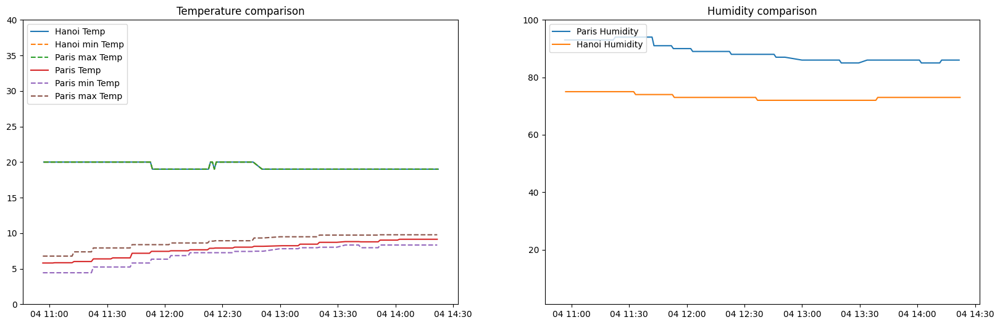
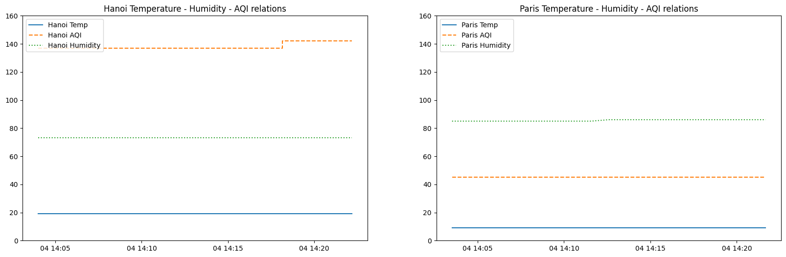

# ASSIGNMENT #1: Data Pipeline with Docker

by Tran Nam Thai - s3891890

---

# Prerequisites

There are 2 APIs needed to be prepare for this task: [Open Weather Map](https://openweathermap.org/api) for weather data and [World Air Quality API](https://aqicn.org/api/) for air quality data.


# Instructions


After obtaining the API keys, update the file **"owm-producer/openweathermap_service.cfg"** and **"custom-api-producer/custom_producer.py"**.

```python
# custom-api-producer/custom_producer.py
TOKEN = "_example_token_" # Update `World Air Quality API` token here
```

```yml
# owm-producer/openweathermap_service.cfg
[openweathermap_api_credential]
access_token = _example_token_ # Update `Open Weather Map` token here
```


## Create docker networks
```bash
$ docker network create kafka-network     # create a new docker network for kafka cluster (zookeeper, broker, kafka-manager services, and kafka connect sink services)
$ docker network create cassandra-network # create a new docker network for cassandra. (kafka connect will exist on this network as well in addition to kafka-network)
```
## Starting Cassandra

Cassandra is setup so it runs keyspace and schema creation scripts at first setup so it is ready to use.
```bash
$ docker-compose -f cassandra/docker-compose.yml up -d
```

## Starting Kafka on Docker
```bash
$ docker-compose -f kafka/docker-compose.yml up -d  # start single zookeeper, broker, kafka-manager and kafka-connect services
$ docker ps -a                                      # sanity check to make sure services are up: kafka_broker_1, kafka-manager, zookeeper, kafka-connect service
```

> **Note:** 
Kafka-Manager front end is available at http://localhost:9000

You can use it to create cluster to view the topics streaming in Kafka.


_**IMPORTANT**_: There is a bug that I don't know how to fix yet. You have to manually go to CLI of the "kafka-connect" container and run the below comment to start the Cassandra sinks.
```
./start-and-wait.sh
```

## Starting Producers
```bash
$ docker-compose -f owm-producer/docker-compose.yml up -d        # start the producer for Open Weather Map
$ docker-compose -f faker-producer/docker-compose.yml up -d      # start the producer for Faker data
$ docker-compose -f custom-api-producer/docker-compose.yml up -d # start the producer for AQI API
```

## Starting Consumers
To check if "flowing" correctly, start consumers
```bash
$ docker-compose -f consumers/docker-compose.yml up -d        # start the all consumers
```

## Check that data is arriving to Cassandra

First login into Cassandra's container with the following command or open a new CLI from Docker Desktop if you use that.
```bash
$ docker exec -it cassandra bash
```
Once loged in, bring up cqlsh with this command and query from tables like this:
```bash
$ cqlsh --cqlversion=3.4.4 127.0.0.1 # make sure you use the correct cqlversion

cqlsh> use kafkapipeline; # keyspace name

describe tables; # -> this should print out all the tables available

cqlsh:kafkapipeline> select * from weatherreport;

cqlsh:kafkapipeline> select * from fakerdata;

cqlsh:kafkapipeline> select * from aqi;

```


## Visualization

Run the following command the go to http://localhost:8888 and run the visualization notebook accordingly

```
docker-compose -f data-vis/docker-compose.yml up -d
```

## Teardown

To stop all running kakfa cluster services

```bash
$ docker-compose -f data-vis/docker-compose.yml down             # stop visualization node

$ docker-compose -f consumers/docker-compose.yml down            # stop the consumers

$ docker-compose -f owm-producer/docker-compose.yml down         # stop open weather map producer

$ docker-compose -f custom-api-producer/docker-compose.yml down  # stop AQI producer

$ docker-compose -f faker-producer/docker-compose.yml down       # stop faker

$ docker-compose -f kafka/docker-compose.yml down                # stop zookeeper, broker, kafka-manager and kafka-connect services

$ docker-compose -f cassandra/docker-compose.yml down            # stop Cassandra
```

!IMPORTANT!: These commands are for your reference, please don't do it as we don't want to spend time downloading resources again in the next tutorial.

To remove the kafka-network network:

```bash
$ docker network rm kafka-network
$ docker network rm cassandra-network
```

To remove resources in Docker

```bash
$ docker container prune # remove stopped containers, done with the docker-compose down
$ docker volume prune # remove all dangling volumes (delete all data from your Kafka and Cassandra)
$ docker image prune -a # remove all images (help with rebuild images)
$ docker builder prune # remove all build cache (you have to pull data again in the next build)
$ docker system prune -a # basically remove everything
```


---

# DATA VISUALIZATION

Below are analysis I got from the data pipeline. The data are recorded from 2 cities: **Hanoi** and **Paris**.

<div style="display: flex; flex-direction: column; align-items: center">
    
    <em>Weather records comparison between 2 cities</em>
</div>

From the two set of plots above describe weather records comparison between 2 cities. I will focus on the first one (on the left). The recorded data are from 2 differents countries (Vietnam and France) with different recorders. We can clearly see how the French record, in terms of data, has a better quality. Hanoi's record has the min, max, current at the same amout throughout the record time. While Paris's record shows how measurement uncertainty are accounted in the calculation. They calculate the range of temperature rather than just output a number. 

$\Longrightarrow$ **This indicated a higher data collecting quality from the Paris's station compares to Hanoi.**

<div style="display: flex; flex-direction: column; align-items: center">
    
    <em>Temperature - Humidity - AQI relations of the two cities</em>
</div>

The set of plots above shows the relation between Temperature, Humidity, and AQI of Paris and Hanoi. Although Paris has higher humidity, which normaly would incrase AQI, it has a significantly lower AQI when compared to Hanoi. Temperature does not seem to affect the AQI.
